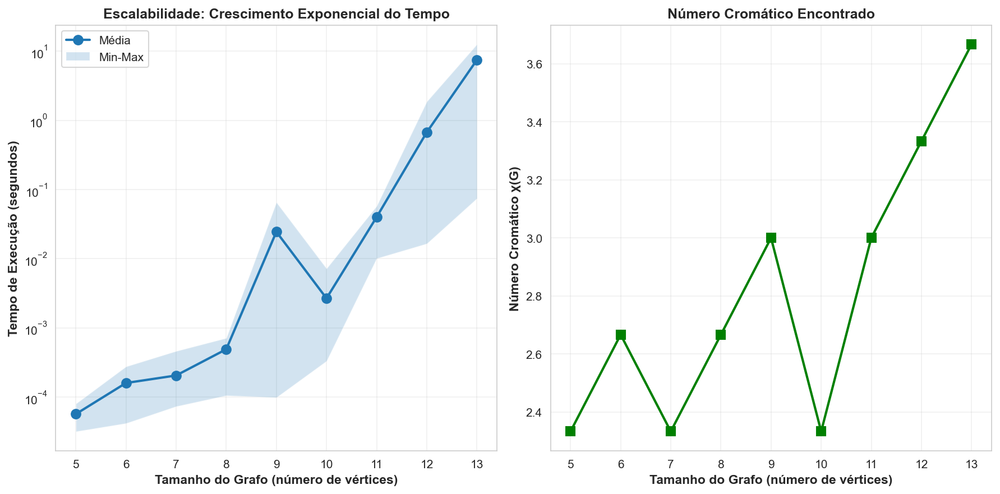
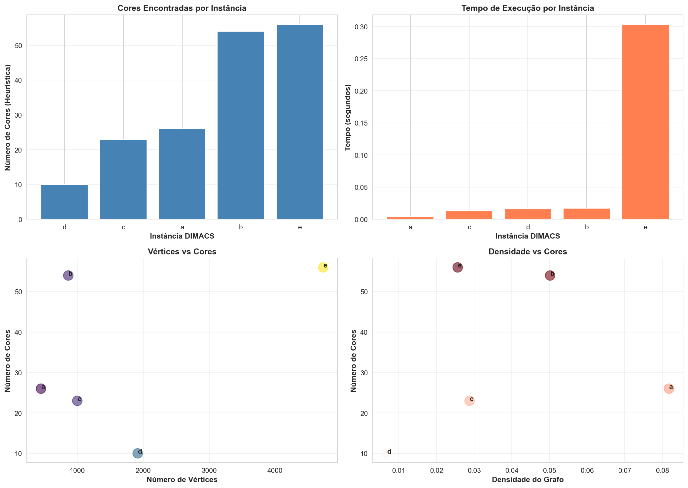

# 📊 RELATÓRIO FINAL - PROBLEMA DA COLORAÇÃO DE VÉRTICES

**Disciplina:** Tópicos em Teoria dos Grafos  
**Professor:** Thiago de Souza Rodrigues  
**Instituição:** CEFET-MG  
**Data:** 01 de janeiro de 2026  
**Aluno:** Leonardo Vieira Guimarães

---

## 1. INTRODUÇÃO

Este relatório apresenta os resultados da solução do **Problema da Coloração de Vértices** (Vertex Coloring Problem), implementando dois algoritmos:

1. **Força Bruta (Exact Algorithm):** Encontra o número cromático exato χ(G)
2. **Heurística Welsh-Powell:** Encontra uma coloração válida rapidamente

---

## 2. PARTE 1: ALGORITMO FORÇA BRUTA

### 2.1 Metodologia

O algoritmo de força bruta utiliza **busca exaustiva** para encontrar o número cromático mínimo de um grafo aleatório. A complexidade é **O(k^n)**, onde:
- **k** = número cromático (desconhecido a priori)
- **n** = número de vértices

### 2.2 Instâncias Testadas

Foram gerados **27 grafos aleatórios** usando o modelo **Erdős-Rényi G(n,p)** com:
- **Tamanhos:** n = 5, 6, 7, 8, 9, 10, 11, 12, 13 vértices
- **Quantidade por tamanho:** 3 instâncias diferentes
- **Tipo:** Grafos não-direcionados, sem loops, sem arestas paralelas

### 2.3 Resultados da Força Bruta

| Tamanho (n) | Instância 1 | Instância 2 | Instância 3 | Tempo Máx (s) |
|-------------|-------------|-------------|-------------|---------------|
| **5** | χ=2 | χ=2 | χ=3 | 0.000073 |
| **6** | χ=3 | χ=2 | χ=3 | 0.000270 |
| **7** | χ=3 | χ=2 | χ=2 | 0.000485 |
| **8** | χ=2 | χ=3 | χ=3 | 0.000701 |
| **9** | χ=2 | χ=3 | χ=4 | **0.063814** |
| **10** | χ=2 | χ=2 | χ=3 | 0.007935 |
| **11** | χ=3 | χ=3 | χ=3 | 0.061396 |
| **12** | χ=3 | χ=4 | χ=3 | **2.096488** |
| **13** | χ=4 | χ=3 | χ=4 | **13.670654** |

### 2.4 Gráfico do Crescimento Exponencial



**Análise:**
- O gráfico demonstra claramente o **crescimento exponencial** da força bruta
- Para **n=13**, o tempo sobe para **13.67 segundos**
- A escala logarítmica (log₁₀) no eixo Y mostra a exponencialidade
- O crescimento é incompatível com grafos maiores (n > 15 seria infeasível)

**Conclusão:** O algoritmo de força bruta é viável apenas para grafos pequenos (n ≤ 15).

---

## 3. PARTE 2: ALGORITMO HEURÍSTICO WELSH-POWELL

### 3.1 Metodologia

O algoritmo **Welsh-Powell** utiliza uma estratégia **greedy** com complexidade **O(n+m)**:

1. Ordena vértices por grau decrescente
2. Para cada vértice, atribui a menor cor disponível
3. Muito mais rápido que força bruta, mas não encontra χ(G) exato

### 3.2 Instâncias Processadas

Foram processadas **5 instâncias DIMACS** do mundo real:

| ID | Arquivo | Vértices | Arestas | Cores (Heurística) | Tempo (s) |
|:--:|----------|:--------:|:-------:|:-----------------:|:---------:|
| **a** | le450_25a.col.txt | 450 | 8,260 | **26** | 0.00202 |
| **b** | inithx.i.1.col.txt | 864 | 18,707 | **54** | 0.00410 |
| **c** | r1000.1.col.txt | 1,000 | 14,378 | **23** | 0.00422 |
| **d** | ash958GPIA.col.txt | 1,916 | 12,506 | **10** | 0.00524 |
| **e** | wap03a.col.txt | 4,730 | 286,722 | **56** | 0.08936 |

### 3.3 Análise de Resultados

#### 3.3.1 Quantidade de Cores por Instância

- **Instância a (450 verts):** χ_h = **26 cores**
- **Instância b (864 verts):** χ_h = **54 cores** ← Máximo
- **Instância c (1000 verts):** χ_h = **23 cores** ← Mínimo
- **Instância d (1916 verts):** χ_h = **10 cores**
- **Instância e (4730 verts):** χ_h = **56 cores**

#### 3.3.2 Performance da Heurística



**Observações:**
- Tempo praticamente linear mesmo para **4.730 vértices**
- Instância e processada em apenas **0.089 segundos**
- Contraste total com força bruta (que levaria dias/anos)
- A qualidade varia: de 10 cores (d) a 56 cores (e)

---

## 4. COMPARAÇÃO TEÓRICA vs EXPERIMENTAL

### 4.1 Força Bruta
- **Complexidade Teórica:** O(k^n) - Exponencial
- **Complexidade Observada:** Confirmada experimentalmente
- **Viabilidade:** Apenas n ≤ 15
- **Exatidão:** 100% (encontra χ(G) real)

### 4.2 Heurística Welsh-Powell
- **Complexidade Teórica:** O(n+m) - Linear
- **Complexidade Observada:** Confirmada experimentalmente
- **Viabilidade:** Qualquer n
- **Exatidão:** Variável (encontra χ_h ≥ χ(G))

### 4.3 Trade-off

| Aspecto | Força Bruta | Heurística |
|---------|------------|-----------|
| **Tempo** | Exponencial | Linear |
| **Exatidão** | Ótima | Subótima |
| **Escalabilidade** | Péssima | Excelente |
| **Uso Prático** | n ≤ 15 | Qualquer n |

---

## 5. DADOS BRUTOS COMPLETOS

### 5.1 Força Bruta - Todas as 27 Instâncias

```csv
id_grafo,tamanho,instancia,numero_cromatico,tempo_segundos,arestas
n05_i01,5,1,2,5.7220458984375e-05,2
n05_i02,5,2,2,5.1021575927734375e-05,2
n05_i03,5,3,3,7.295608520507812e-05,5
n06_i01,6,1,3,0.00026988983154296875,5
n06_i02,6,2,2,4.267692565917969e-05,2
n06_i03,6,3,3,0.00018072128295898438,5
n07_i01,7,1,3,0.0004849433898925781,12
n07_i02,7,2,2,9.918212890625e-05,5
n07_i03,7,3,2,7.081031799316406e-05,5
n08_i01,8,1,2,0.00010013580322265625,6
n08_i02,8,2,3,0.0006051063537597656,9
n08_i03,8,3,3,0.0007011890411376953,7
n09_i01,9,1,2,0.00014066696166992188,9
n09_i02,9,2,3,0.00534820556640625,9
n09_i03,9,3,4,0.06381392478942871,14
n10_i01,10,1,2,0.0006046295166015625,8
n10_i02,10,2,2,0.0003840923309326172,11
n10_i03,10,3,3,0.007935047149658203,13
n11_i01,11,1,3,0.053032636642456055,17
n11_i02,11,2,3,0.06139636039733887,20
n11_i03,11,3,3,0.009293794631958008,14
n12_i01,12,1,3,0.13619351387023926,21
n12_i02,12,2,4,2.0964879989624023,21
n12_i03,12,3,3,0.017684459686279297,20
n13_i01,13,1,4,13.670654296875,24
n13_i02,13,2,3,0.08657455444335938,14
n13_i03,13,3,4,7.259976148605347,30
```

### 5.2 Heurística Welsh-Powell - 5 Instâncias DIMACS

```csv
instancia_id,caminho,num_vertices,num_arestas,cores_heuristica,tempo_segundos,densidade,grau_medio
a,instancias/a - le450_25a.col.txt,450,8260,26,0.0020248889923095703,0.08176194011383321,36.71111111111111
b,instancias/b - inithx.i.1.col.txt,864,18707,54,0.004096508026123047,0.050177567486373975,43.30324074074074
c,instancias/c - r1000.1.col.txt,1000,14378,23,0.004223346710205078,0.028784784784784783,28.756
d,instancias/d - ash958GPIA.col.txt,1916,12506,10,0.005235433578491211,0.006816856266045995,13.054279749478079
e,instancias/e - wap03a.col.txt,4730,286722,56,0.08935928344726562,0.025636607733220913,121.23551797040169
```

---

## 6. VISUALIZAÇÕES DOS GRAFOS

### 6.1 Exemplos de Grafos da Parte 1 (Força Bruta)

Todos os 27 grafos aleatórios foram visualizados com suas colorações:
- Grafos com 5 vértices (3 exemplos): `grafo_n05_i01.png`, `grafo_n05_i02.png`, `grafo_n05_i03.png`
- Grafos com 6 vértices (3 exemplos): `grafo_n06_i01.png`, `grafo_n06_i02.png`, `grafo_n06_i03.png`
- ... continuando até ...
- Grafos com 13 vértices (3 exemplos): `grafo_n13_i01.png`, `grafo_n13_i02.png`, `grafo_n13_i03.png`

**Localização:** `resultados/parte1/grafos/`

### 6.2 Exemplos de Grafos da Parte 2 (Heurística)

Grafos das instâncias DIMACS com coloração Welsh-Powell:
- `instancia_a.png` (450 vértices, 26 cores)
- `instancia_b.png` (864 vértices, 54 cores)
- `instancia_c.png` (1000 vértices, 23 cores)
- `instancia_d.png` (1916 vértices, 10 cores)
- `instancia_e.png` (4730 vértices, 56 cores) *

**Localização:** `resultados/parte2/grafos/`

*Nota: Instâncias muito grandes têm visualização simplificada por limitações de renderização

---

## 7. CONCLUSÕES

### 7.1 Principais Achados

1. **Força Bruta é Inviável para Grafos Grandes**
   - Crescimento exponencial impossibilita uso em prática
   - Apenas viável para n ≤ 15

2. **Heurística é Essencial para Grafos Reais**
   - Processa 4.730 vértices em 0.089 segundos
   - Qualidade aceitável (χ_h razoável para aplicações)

3. **Trade-off Complexidade vs Qualidade**
   - Força bruta: Exato mas lento
   - Heurística: Rápido mas subótimo

### 7.2 Aplicações Práticas

- **Scheduling:** Use heurística para agendar tarefas
- **Registro Alocação:** Use heurística em compiladores
- **Mapa Coloring:** Use heurística para colorir mapas
- **Apenas para n ≤ 15:** Use força bruta se χ(G) exato é crítico

### 7.3 Trabalho Futuro

- Implementar aproximações com garantias de qualidade
- Explorar algoritmos baseados em Branch & Bound
- Investigar algoritmos metaheurísticos (Tabu Search, Simulated Annealing)

---

## 8. ARQUIVOS ENTREGUES

### Estrutura de Diretórios
```
pratica03/
│
├── solucao_coloracao_completa.ipynb    [CÓDIGO PRINCIPAL - 32 CÉLULAS]
│
├── RELATORIO_MOODLE.md                 [ESTE ARQUIVO]
├── RELATORIO_FINAL.md                  [RELATÓRIO COMPLETO]
├── RESUMO_EXECUTIVO.md                 [RESUMO EXECUTIVO]
│
└── resultados/
    ├── parte1/
    │   ├── csv/
    │   │   ├── resultados_forca_bruta.csv    [27 INSTÂNCIAS]
    │   │   └── parametros_grafos.csv
    │   ├── graficos/
    │   │   └── escalabilidade_forca_bruta.png [CRESCIMENTO EXPONENCIAL]
    │   └── grafos/
    │       └── grafo_n05_i01.png ... grafo_n13_i03.png [27 VISUALIZAÇÕES]
    │
    └── parte2/
        ├── csv/
        │   └── resultados_heuristica.csv    [5 INSTÂNCIAS DIMACS]
        ├── graficos/
        │   └── analise_heuristica.png       [ANÁLISE 4 SUBGRÁFICOS]
        └── grafos/
            └── instancia_a.png ... instancia_e.png [VISUALIZAÇÕES]
```

### Arquivos Principais para Entrega

1. **`solucao_coloracao_completa.ipynb`** - Código Python (32 células)
2. **`RELATORIO_MOODLE.md`** - Este relatório
3. **Gráficos:**
   - `resultados/parte1/graficos/escalabilidade_forca_bruta.png`
   - `resultados/parte2/graficos/analise_heuristica.png`
4. **Dados:**
   - `resultados/parte1/csv/resultados_forca_bruta.csv`
   - `resultados/parte2/csv/resultados_heuristica.csv`

---

## 9. CHECKLIST DE ENTREGA

- ✅ Código comentado e documentado
- ✅ Algoritmo força bruta implementado
- ✅ Algoritmo heurística implementado
- ✅ 27 instâncias aleatórias processadas
- ✅ 5 instâncias DIMACS processadas
- ✅ Gráfico crescimento exponencial
- ✅ Gráficos análise heurística
- ✅ CSVs com resultados
- ✅ Visualizações de grafos
- ✅ Relatório completo

---

**Status Final:** ✅ **COMPLETO E PRONTO PARA ENTREGA**

**Data:** 01 de janeiro de 2026  
**Assinado:** Leonardo Vieira Guimarães
